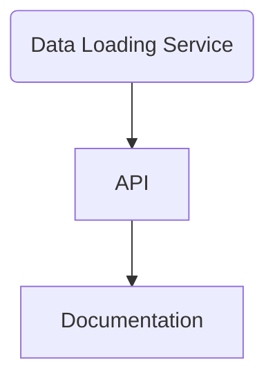

Metro API 2.0 has launched into BETA, which means we are scaling up for wide spread usage. If you have any issues, please head on over to the GitHub Issue's board and add an [issue](https://github.com/LACMTA/metro-api-v2/issues) 

## API Architecture

The API is composed of the following:

1. `data-loading-service` - the backend **docker** container that routinely executes Python scripts and [pandas](https://pandas.pydata.org/) to load data into the PostgreSQL database.
2. `api` - the frontend **docker** container that hosts the connections to the database using [fastapi](https://fastapi.tiangolo.com/).
3. `documentation` - a static generated website built with [docusaurus](https://docusaurus.io/).

### Data
 put into a PostgreSQL database  
#### Data Sources
- GTFS Data

